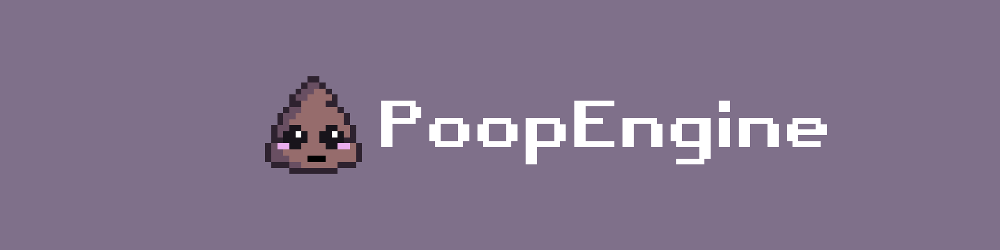

    
    
    
    
    
     
    <b>Project Status:</b> Not Started!

 

What is PoopEngine?\
A game engine framework that is based on monogame and is free to use for anyone.

I don't know when I will start working on it but remember to star this repo so you can easily find it. :)

And also I wanna add only because this framework for monogame is called PoopEngine doesn't mean its gonna be trash...